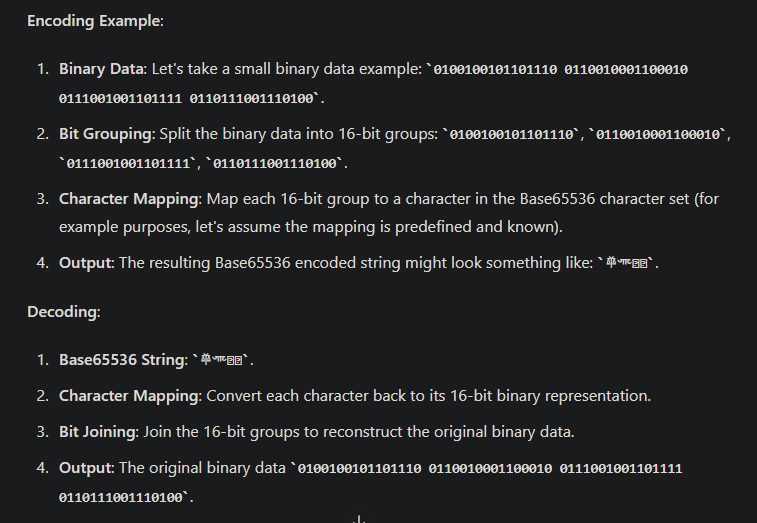

# Author : https://hackmyvm.eu/profile/?user=mao7un

⏲️ Release Date // 2024-01-02

💀 Solvers // 8

🧩 Type // crypto


```
鵷𓁥鑥陨驶𖥟𓍯靟驥鑮𒅲汪潟ᔩ Ex: HMV{Flag}
```

# Answer

```
above text is a base cipher and we should find the type of it . 
i asked chatgpt 
```



# Online  decoder 

https://www.better-converter.com/Encoders-Decoders/Base65536-Decode


```
FLAG :

MHV{where_have_you_been_rpj7_:)}

```
