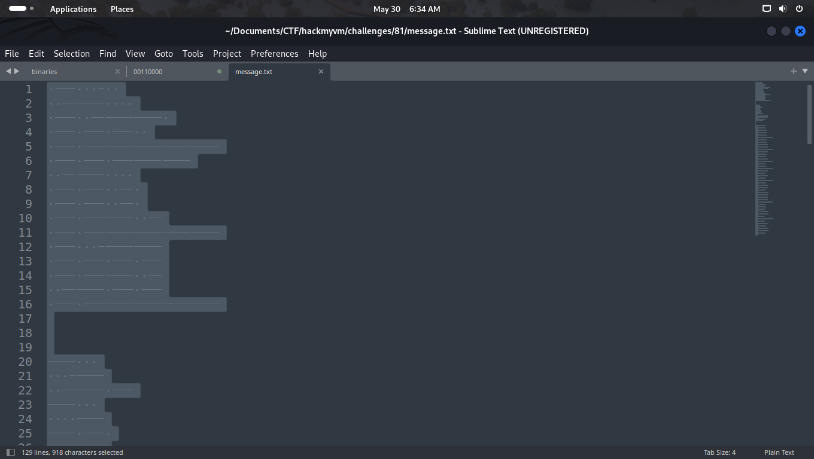

# 081
created by || MrMidnight
⏲️ Release Date // 2024-01-05

💀 Solvers // 9

🧩 Type // crypto

```bash
┌──(kali💀kali)-[~/…/CTF/hackmyvm/challenges/81]
└─$ cat message.txt -A                                
 ^I   ^I  $
  ^I^I    $
 ^I  ^I^I^I $
 ^I ^I ^I  $
 ^I ^I^I^I^I^I$
 ^I ^I ^I^I^I$
  ^I^I    $
 ^I ^I  ^I $
 ^I ^I  ^I $
 ^I ^I^I  ^I$
 ^I ^I^I^I^I^I$
 ^I   ^I^I^I$
 ^I ^I ^I ^I$
 ^I ^I^I  ^I$
  ^I^I ^I ^I$
 ^I ^I^I^I^I^I$
$
$
$
^I   $
   ^I^I$
  ^I^I ^I$
^I   $
    ^I$
^I ^I $
^I ^I$
  ^I^I ^I$
   $
^I^I^I^I^I$
^I^I^I^I^I$
^I $
^I ^I ^I^I$
  ^I^I ^I$
$
$
$
   ^I   ^I^I^I$
^I$
      ^I^I    $
^I$
     ^I ^I ^I  $
^I$
     ^I ^I ^I  $
^I$
      ^I^I ^I  $
^I$
     ^I ^I^I^I^I^I$
^I$
     ^I ^I ^I  $
^I$
      ^I^I ^I  $
^I$
     ^I  ^I ^I^I$
^I$
      ^I^I  ^I^I$
^I$
     ^I ^I^I^I^I^I$
^I$
     ^I    ^I^I$
^I$
      ^I^I ^I  $
^I$
     ^I ^I  ^I $
^I$
      ^I^I  ^I^I$
^I$
     ^I ^I^I^I^I^I$
^I$
      ^I^I    $
^I$
     ^I   ^I^I $
^I$
     ^I ^I^I^I^I^I$
^I$
     ^I ^I  ^I^I$
^I$
      ^I^I    $
^I$
     ^I  ^I^I ^I$
^I$
     ^I   ^I ^I$
^I$
     ^I ^I^I^I^I^I$
^I$
     ^I    ^I $
^I$
     ^I ^I ^I ^I$
^I$
      ^I^I ^I ^I$
^I$
      ^I^I   ^I$
^I$
     ^I  ^I^I^I $
^I$
      ^I^I  ^I^I$
^I$
      ^I^I ^I ^I$
^I$
      ^I^I ^I ^I$
^I$
     ^I ^I^I^I^I^I$
^I$
     ^I     ^I$
^I$
     ^I ^I  ^I $
^I$
      ^I^I    $
^I$
     ^I ^I ^I ^I$
^I$
     ^I  ^I^I^I $
^I$
     ^I   ^I  $
^I$
     ^I ^I^I^I^I^I$
^I$
     ^I  ^I   $
^I$
      ^I^I  ^I^I$
^I$
     ^I ^I  ^I $
^I$
      ^I^I  ^I^I$
^I$
      ^I^I^I ^I $
^I$
      ^I ^I  ^I$
^I$
```

```
Sublime output shows some morse code 
challenge  has three parts 
```
```
The caret "^" followed by "I" reperesents tab character . 
dollar signs at the end of each line is point to end of line 
so we got some tabs and spaces 
only two chracter repeated so we can assume that might be binaries
lets conver it .
```

# First Part

```bash
┌──(kali💀kali)-[~/…/CTF/hackmyvm/challenges/81]
└─$ cat message.txt | sed -e "s/ /0/g" -e "s/\t/1/g"
01000100
00110000
01001110
01010100
01011111
01010111
00110000
01010010
01010010
01011001
01011111
01000111
01010101
01011001
00110101
01011111


1000
00011
001101
1000
00001
1010
101
001101
000
11111
11111
10
101011
001101


0001000111
1
000000110000
1
000001010100
1
000001010100
1
000000110100
1
000001011111
1
000001010100
1
000000110100
1
000001001011
1
000000110011
1
000001011111
1
000001000011
1
000000110100
1
000001010010
1
000000110011
1
000001011111
1
000000110000
1
000001000110
1
000001011111
1
000001010011
1
000000110000
1
000001001101
1
000001000101
1
000001011111
1
000001000010
1
000001010101
1
000000110101
1
000000110001
1
000001001110
1
000000110011
1
000000110101
1
000000110101
1
000001011111
1
000001000001
1
000001010010
1
000000110000
1
000001010101
1
000001001110
1
000001000100
1
000001011111
1
000001001000
1
000000110011
1
000001010010
1
000000110011
1
000000111010
1
000000101001
1
00 
```

```
From first part we got these :
01000100
00110000
01001110
01010100
01011111
01010111
00110000
01010010
01010010
01011001
01011111
01000111
01010101
01011001
00110101
01011111
```
> D0NT_W0RRY_GUY5_
# Second Part
```
1000
00011
001101
1000
00001
1010
101
001101
000
11111
11111
10
101011
001101
```
```
Second part is not like binaries so
from sublime i thought it might be morse code 
we can conver one,s to '-' and zero,s to '.' 
to get a correct flag
```

```bash
┌──(kali💀kali)-[~/…/CTF/hackmyvm/challenges/81]
└─$ cat second  | sed -e 's/1/-/g'  -e  's/0/./g'
-...
...--
..--.-
-...
....-
-.-.
-.-
..--.-
...
-----
-----
-.
-.-.--
..--.-
```
# Second Flag

>B3_B4CK_S00N!_

# Third Part

```
0001000111
1
000000110000
1
000001010100
1
000001010100
1
000000110100
1
000001011111
1
000001010100
1
000000110100
1
000001001011
1
000000110011
1
000001011111
1
000001000011
1
000000110100
1
000001010010
1
000000110011
1
000001011111
1
000000110000
1
000001000110
1
000001011111
1
000001010011
1
000000110000
1
000001001101
1
000001000101
1
000001011111
1
000001000010
1
000001010101
1
000000110101
1
000000110001
1
000001001110
1
000000110011
1
000000110101
1
000000110101
1
000001011111
1
000001000001
1
000001010010
1
000000110000
1
000001010101
1
000001001110
1
000001000100
1
000001011111
1
000001001000
1
000000110011
1
000001010010
1
000000110011
1
000000111010
1
000000101001
1
00 
```
```
For third part  we have lots of extra one,s 
length of binaries is incorrect we should change it to 8
```
```bash
┌──(kali💀kali)-[~/…/CTF/hackmyvm/challenges/81]
└─$ cat third | grep -E '^.{12}$' | sed 's/^....//g' 
00110000
01010100
01010100
00110100
01011111
01010100
00110100
01001011
00110011
01011111
01000011
00110100
01010010
00110011
01011111
00110000
01000110
01011111
01010011
00110000
01001101
01000101
01011111
01000010
01010101
00110101
00110001
01001110
00110011
00110101
00110101
01011111
01000001
01010010
00110000
01010101
01001110
01000100
01011111
01001000
00110011
01010010
00110011
00111010
00101001
```
```
On the aobve command all grep all the binaries that contain 12 length 
and removed four first index to make them 8 byte . below is result 
```

```
┌──(kali💀kali)-[~/…/CTF/hackmyvm/challenges/81]
└─$ cat third | grep -E '^.{12}$' | sed 's/^....//g' 
00110000
01010100
01010100
00110100
01011111
01010100
00110100
01001011
00110011
01011111
01000011
00110100
01010010
00110011
01011111
00110000
01000110
01011111
01010011
00110000
01001101
01000101
01011111
01000010
01010101
00110101
00110001
01001110
00110011
00110101
00110101
01011111
01000001
01010010
00110000
01010101
01001110
01000100
01011111
01001000
00110011
01010010
00110011
00111010
00101001
```
>G0TT4_T4K3_C4R3_0F_S0ME_BU51N355_AR0UND_H3R3:)

# Final Flag
 
>D0NT_W0RRY_GUY5_B3_B4CK_S00N!_G0TT4_T4K3_C4R3_0F_S0ME_BU51N355_AR0UND_H3R3:)